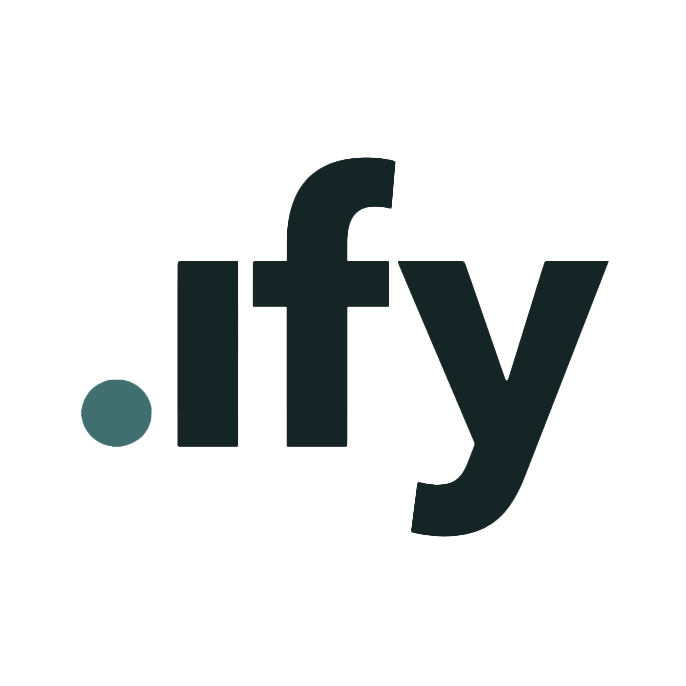

  <picture>
    <source media="(prefers-color-scheme: dark)" srcset="brand/logo-dark.png">
    
  </picture>

# .ify

growing set of focused agentic tools. Each does one narrow job well, closes a gap that keeps coming up in real work, and builds on existing open-source tools rather than reinventing them.

Many of the early tools come out of AEC (architecture, engineering, construction), but .ify isn't scoped to it — any workflow with a repetitive, mechanical gap is fair game.

It's early days; the portfolio will grow one tool at a time, in the open.

Apache 2.0; contributions accepted under the same license.

## Projects

Each tool lives in its own repository and is listed here as it ships.

- **[skillmeld](https://github.com/ifylab/skillmeld)** — discovers existing community Claude skills for a use case, security-scans them, and merges the best few into one tailored set. Composes existing skills rather than generating new ones.
- **[wireify](https://github.com/ifylab/wireify)** — your own Claude Code, live in Grasshopper. Stage inputs on a socket, say what the component should do; it converts in place into a stock Python 3 component, and saved files carry no plugin dependency. On the Rhino Package Manager.
- **[robotic constructability](https://github.com/goldsmith323/Robotic-Constructability)** — interactive explorer for 999 robotically assembled CLT house designs, the open-source companion to a peer-reviewed study. Live at [constructability.ifylab.dev](https://constructability.ifylab.dev).

## About this repository

The hub holds the brand, shared tooling, and the index that points at each tool — not the tools themselves. Each tool is an independent repository with its own versioning, releases, and issues.

## License

Apache License 2.0 — see [LICENSE](LICENSE) and [NOTICE](NOTICE). Contributions are accepted under the same license; no separate contributor agreement is required.
